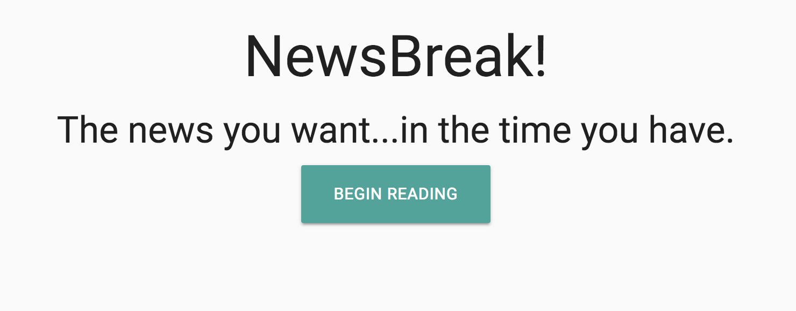

#Project Name  
NewsBreak!  

The news you want...in the time you have. 

#Brief description  
NewsBreak provides curated articles on specific topics based on user choice within the time window that the user has. 

#Screenshot of homepage  
Screenshot can be found here: 

#Gif of User Flow  
User flow can be found here: 

#Technologies Used
- HTML
- Javascript/jQuery
- Materialize
- Firebase
- AJAX
- NYTimes API 
- The Guardian API

##Collaborators
Josh Bay, Dulguun Enkh, Victoria Tu

